# DOKUMENTASI SISTEM CARBON CALCULATOR APP (CARBCALC)
## Analisis Sistem dan Desain UML

**Versi:** 1.0  
**Tanggal:** Desember 2024  
**System Analyst:** [Nama Anda]  
**Project:** Carbon Footprint Tracking Application

---

## DAFTAR ISI

1. [Pendahuluan](#1-pendahuluan)
2. [Analisis Proses Bisnis](#2-analisis-proses-bisnis)
3. [Diagram Use Case](#3-diagram-use-case)
4. [Diagram Aktivitas](#4-diagram-aktivitas)
5. [Diagram Sequence](#5-diagram-sequence)
6. [Diagram Kelas](#6-diagram-kelas)
7. [Entity Relationship Diagram (ERD)](#7-entity-relationship-diagram-erd)
8. [Software Architecture (C4 Model)](#8-software-architecture-c4-model)
9. [Deployment Diagram](#9-deployment-diagram)
10. [Data Flow Diagram](#10-data-flow-diagram)
11. [Wireframe](#11-wireframe)
12. [Kesimpulan](#12-kesimpulan)

---

## 1. PENDAHULUAN

### 1.1 Tujuan Dokumen
Dokumen ini berisi analisis sistem dan desain UML untuk aplikasi Carbon Calculator (CarbCalc) yang bertujuan untuk membantu pengguna melacak jejak karbon mereka dan mendapatkan rekomendasi untuk mengurangi emisi.

### 1.2 Ruang Lingkup Sistem
CarbCalc adalah aplikasi web berbasis Next.js yang memungkinkan pengguna untuk:
- Menghitung jejak karbon dari aktivitas harian
- Melihat visualisasi data emisi
- Mendapatkan rekomendasi AI untuk mengurangi emisi
- Mengelola rencana aksi berkelanjutan
- Berbagi pencapaian di media sosial

### 1.3 Stakeholder
- **Pengguna Umum**: Individu yang ingin melacak jejak karbon
- **Administrator**: Mengelola sistem dan data master
- **Peneliti**: Mengakses data agregat untuk penelitian
- **Pemerintah**: Mengakses laporan dan statistik

---

## 2. ANALISIS PROSES BISNIS

### 2.1 Proses Bisnis AS-IS (Kondisi Saat Ini)

#### Proses Manual Pelacakan Jejak Karbon
```
1. Individu mencatat aktivitas harian secara manual
2. Mencari faktor emisi dari berbagai sumber
3. Menghitung jejak karbon menggunakan kalkulator sederhana
4. Menyimpan data dalam spreadsheet pribadi
5. Sulit mendapatkan rekomendasi yang personal
6. Tidak ada sistem gamifikasi atau motivasi
7. Sharing pencapaian dilakukan manual
```

**Masalah AS-IS:**
- Proses manual dan memakan waktu
- Data tidak terintegrasi
- Sulit mendapatkan insight yang bermakna
- Tidak ada motivasi berkelanjutan
- Akurasi perhitungan tidak konsisten

### 2.2 Proses Bisnis TO-BE (Kondisi Yang Diinginkan)

#### Proses Otomatis dengan CarbCalc
```
1. Pengguna login ke sistem CarbCalc
2. Input aktivitas harian melalui form yang user-friendly
3. Sistem otomatis menghitung jejak karbon menggunakan faktor emisi terkini
4. Data tersimpan otomatis dan terintegrasi
5. AI memberikan rekomendasi personal
6. Sistem gamifikasi memberikan motivasi
7. Sharing otomatis ke media sosial
8. Laporan dan analisis tersedia real-time
```

**Keuntungan TO-BE:**
- Proses otomatis dan efisien
- Data terintegrasi dan akurat
- Insight real-time dengan visualisasi
- Motivasi berkelanjutan melalui gamifikasi
- Rekomendasi AI yang personal

---

## 3. DIAGRAM USE CASE

### 3.1 Identifikasi Aktor

| Kode | Aktor | Deskripsi |
|------|-------|-----------|
| A01 | Pengguna | Individu yang menggunakan aplikasi untuk melacak jejak karbon |
| A02 | Administrator | Mengelola sistem, data master, dan pengguna |
| A03 | Peneliti | Mengakses data agregat untuk penelitian |
| A04 | Sistem AI | Sistem eksternal untuk memberikan rekomendasi |

### 3.2 Identifikasi Use Case

#### Use Case Level 0 (Sistem Utama)
```
UC-00: Mengelola Jejak Karbon
```

#### Use Case Level 1 (Fungsional Utama)
| Kode | Use Case | Aktor | Deskripsi |
|------|----------|-------|-----------|
| UC-01 | Mengelola Autentikasi | Pengguna | Login, logout, registrasi, reset password |
| UC-02 | Mengelola Profil | Pengguna | Melihat dan mengubah profil pengguna |
| UC-03 | Menghitung Jejak Karbon | Pengguna | Input aktivitas dan hitung emisi |
| UC-04 | Mengelola Data Aktivitas | Pengguna | CRUD data aktivitas emisi |
| UC-05 | Melihat Visualisasi Data | Pengguna | Dashboard, chart, dan laporan |
| UC-06 | Mengelola Rekomendasi | Pengguna, Sistem AI | Mendapat dan mengelola rekomendasi |
| UC-07 | Mengelola Rencana Aksi | Pengguna | CRUD todo list dari rekomendasi |
| UC-08 | Berbagi ke Media Sosial | Pengguna | Generate dan share infografis |
| UC-09 | Mengelola Sistem | Administrator | Kelola pengguna, faktor emisi, sistem |
| UC-10 | Mengakses Data Penelitian | Peneliti | Akses data agregat untuk riset |

#### Use Case Level 2 (Detail Breakdown)

**UC-03: Menghitung Jejak Karbon**
- UC-03.1: Input Data Transportasi
- UC-03.2: Input Data Energi  
- UC-03.3: Input Data Makanan
- UC-03.4: Input Data Limbah
- UC-03.5: Kalkulasi Total Emisi

**UC-04: Mengelola Data Aktivitas**
- UC-04.1: Tambah Data Aktivitas
- UC-04.2: Lihat Data Aktivitas
- UC-04.3: Ubah Data Aktivitas
- UC-04.4: Hapus Data Aktivitas

**UC-07: Mengelola Rencana Aksi**
- UC-07.1: Buat Todo dari Rekomendasi
- UC-07.2: Tandai Todo Selesai
- UC-07.3: Hapus Todo
- UC-07.4: Lihat Progress Todo

### 3.3 Diagram Use Case

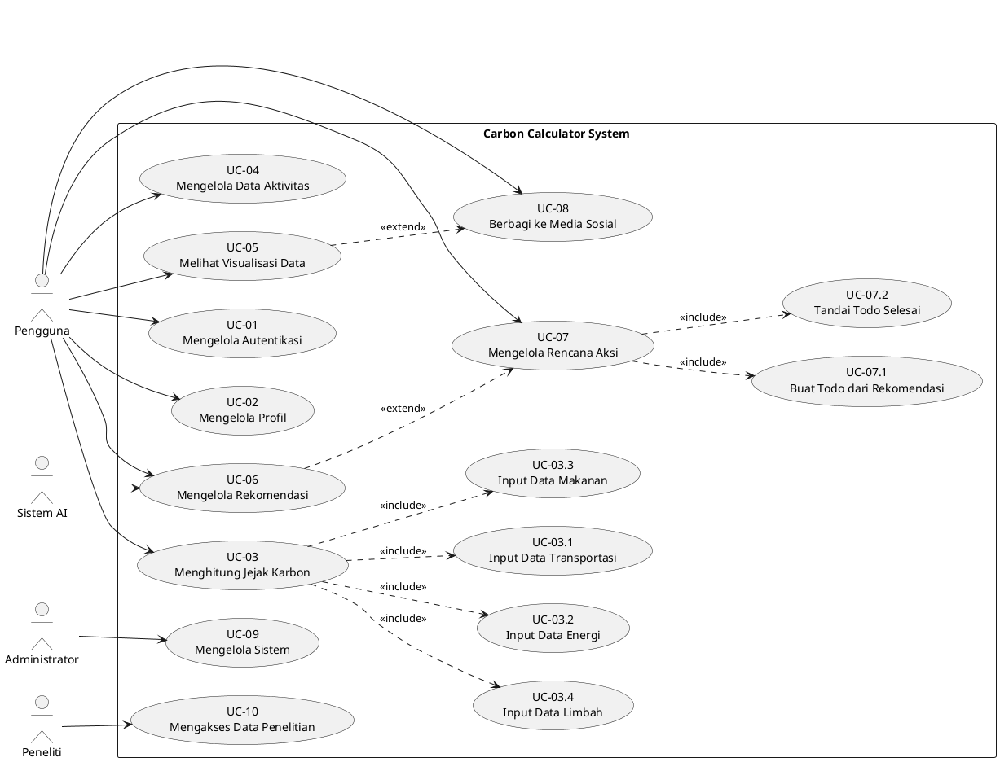

### 3.4 Spesifikasi Use Case Detail

#### UC-03: Menghitung Jejak Karbon

**Kode:** UC-03  
**Nama:** Menghitung Jejak Karbon  
**Aktor:** Pengguna  
**Deskripsi:** Pengguna menginput data aktivitas harian dan sistem menghitung jejak karbon

**Precondition:**
- Pengguna sudah login
- Data faktor emisi tersedia

**Main Flow:**
1. Pengguna memilih kategori aktivitas (Transportasi/Energi/Makanan/Limbah)
2. Sistem menampilkan form input sesuai kategori
3. Pengguna mengisi data aktivitas
4. Sistem validasi input data
5. Sistem menghitung emisi menggunakan faktor emisi
6. Sistem menyimpan data ke database
7. Sistem menampilkan hasil perhitungan

**Alternative Flow:**
- 4a. Data tidak valid: Sistem menampilkan pesan error
- 6a. Gagal simpan: Sistem menampilkan pesan error

**Postcondition:**
- Data aktivitas tersimpan
- Jejak karbon terhitung dan ditampilkan

---

## 4. DIAGRAM AKTIVITAS

### 4.1 Activity Diagram - Menghitung Jejak Karbon (UC-03)

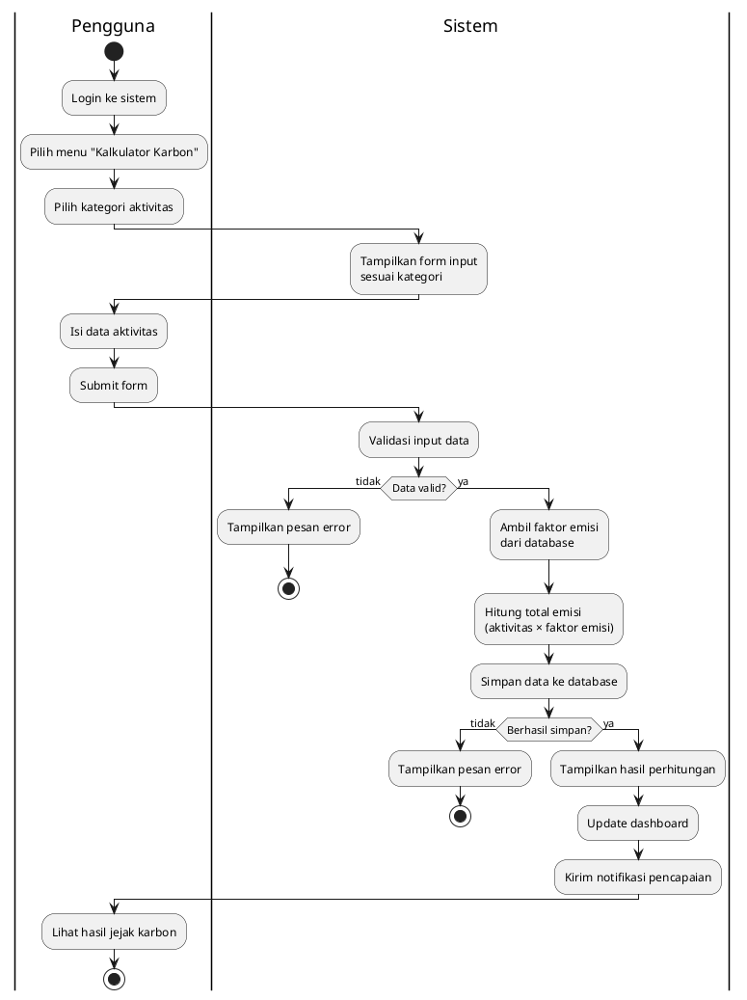

### 4.2 Activity Diagram - Mengelola Rencana Aksi (UC-07)

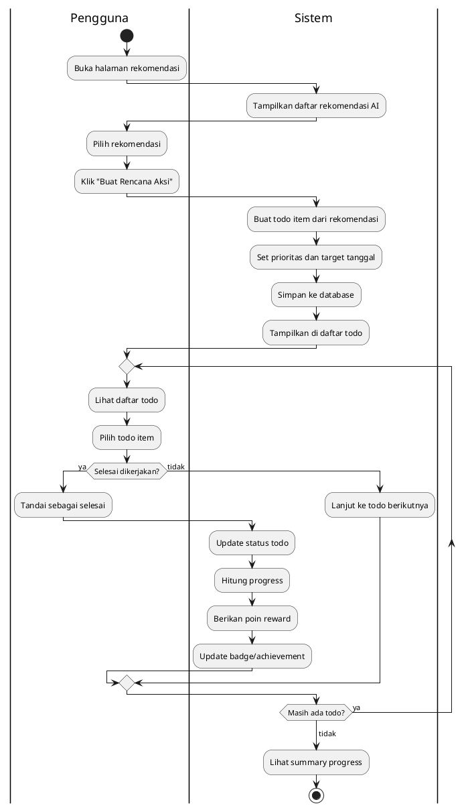

---

## 5. DIAGRAM SEQUENCE

### 5.1 Sequence Diagram - Menghitung Jejak Karbon

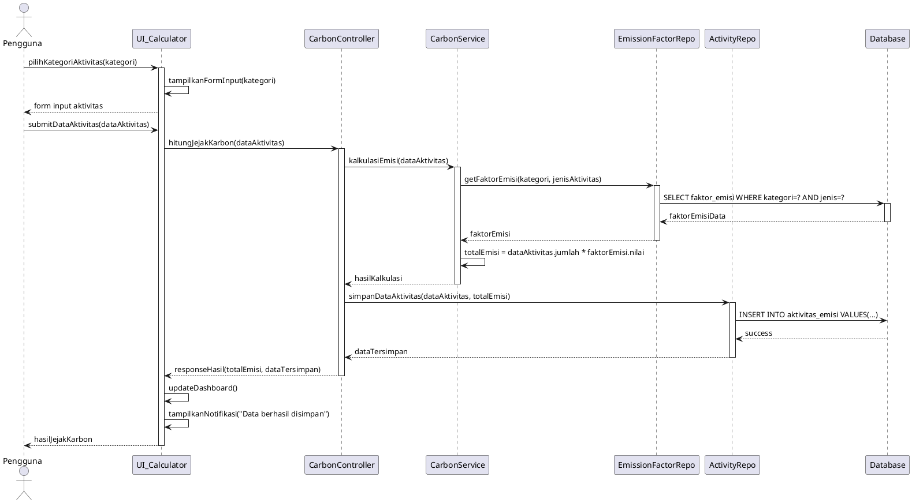

### 5.2 Sequence Diagram - Mendapatkan Rekomendasi AI

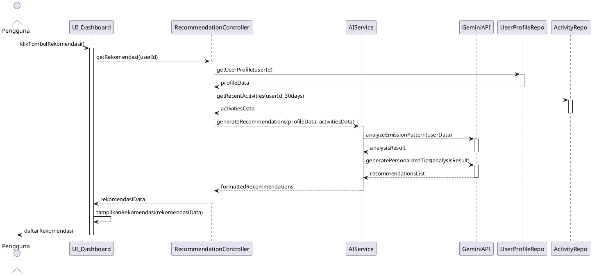

---

## 6. DIAGRAM KELAS

### 6.1 Class Diagram - Domain Model

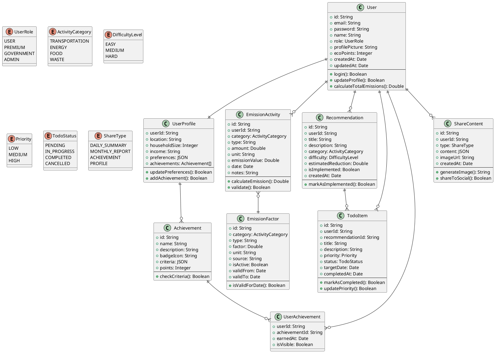

### 6.2 Class Diagram - Controller Layer

```plantuml
@startuml ClassDiagram_Controller
class AuthController {
  -authService: AuthService
  --
  +login(credentials): Response
  +register(userData): Response
  +logout(): Response
  +resetPassword(email): Response
}

class CarbonController {
  -carbonService: CarbonService
  -activityRepo: ActivityRepository
  --
  +calculateEmission(activityData): Response
  +getActivities(userId, filters): Response
  +updateActivity(id, data): Response
  +deleteActivity(id): Response
}

class RecommendationController {
  -aiService: AIService
  -recommendationRepo: RecommendationRepository
  --
  +getRecommendations(userId): Response
  +generateNewRecommendations(userId): Response
  +markAsImplemented(id): Response
}

class TodoController {
  -todoService: TodoService
  -todoRepo: TodoRepository
  --
  +createTodo(todoData): Response
  +getTodos(userId): Response
  +updateTodoStatus(id, status): Response
  +deleteTodo(id): Response
}

class ProfileController {
  -profileService: ProfileService
  -userRepo: UserRepository
  --
  +getProfile(userId): Response
  +updateProfile(userId, data): Response
  +getAchievements(userId): Response
}

class ShareController {
  -shareService: ShareService
  -canvasService: CanvasService
  --
  +generateShareImage(userId, type): Response
  +shareToSocial(platform, content): Response
}

class DashboardController {
  -dashboardService: DashboardService
  -analyticsService: AnalyticsService
  --
  +getDashboardData(userId): Response
  +getChartData(userId, period): Response
  +getAirQualityData(location): Response
}

' Dependencies
AuthController --> AuthService
CarbonController --> CarbonService
RecommendationController --> AIService
TodoController --> TodoService
ProfileController --> ProfileService
ShareController --> ShareService
DashboardController --> DashboardService

@enduml
```

### 6.3 Class Diagram - Service Layer

```plantuml
@startuml ClassDiagram_Service
interface IAuthService {
  +authenticate(credentials): User
  +createUser(userData): User
  +resetPassword(email): Boolean
}

class AuthService {
  -userRepo: UserRepository
  -passwordEncoder: PasswordEncoder
  --
  +authenticate(credentials): User
  +createUser(userData): User
  +resetPassword(email): Boolean
  +generateToken(user): String
}

interface ICarbonService {
  +calculateEmission(activityData): Double
  +saveActivity(activityData): EmissionActivity
  +getEmissionFactor(category, type): EmissionFactor
}

class CarbonService {
  -factorRepo: EmissionFactorRepository
  -activityRepo: ActivityRepository
  --
  +calculateEmission(activityData): Double
  +saveActivity(activityData): EmissionActivity
  +getEmissionFactor(category, type): EmissionFactor
  +validateActivityData(data): Boolean
}

interface IAIService {
  +generateRecommendations(userData): List<Recommendation>
  +analyzeEmissionPattern(activities): AnalysisResult
}

class AIService {
  -geminiClient: GeminiClient
  -recommendationRepo: RecommendationRepository
  --
  +generateRecommendations(userData): List<Recommendation>
  +analyzeEmissionPattern(activities): AnalysisResult
  +formatRecommendations(aiResponse): List<Recommendation>
}

class TodoService {
  -todoRepo: TodoRepository
  -notificationService: NotificationService
  --
  +createTodoFromRecommendation(rec): TodoItem
  +updateTodoStatus(id, status): Boolean
  +calculateProgress(userId): ProgressData
}

class ShareService {
  -canvasService: CanvasService
  -socialMediaAPI: SocialMediaAPI
  --
  +generateShareImage(data): String
  +shareToTwitter(content): Boolean
  +shareToInstagram(content): Boolean
}

class DashboardService {
  -activityRepo: ActivityRepository
  -analyticsService: AnalyticsService
  --
  +getDashboardSummary(userId): DashboardData
  +getEmissionTrends(userId, period): TrendData
  +getComparativeData(userId): ComparisonData
}

' Implementations
AuthService ..|> IAuthService
CarbonService ..|> ICarbonService
AIService ..|> IAIService

' Dependencies
AuthService --> UserRepository
CarbonService --> EmissionFactorRepository
CarbonService --> ActivityRepository
AIService --> GeminiClient
TodoService --> TodoRepository
ShareService --> CanvasService
DashboardService --> ActivityRepository

@enduml
```

---

## 7. ENTITY RELATIONSHIP DIAGRAM (ERD)

### 7.1 ERD - Database Schema

```plantuml
@startuml ERD_CarbCalc
!define table(x) class x << (T,#FFAAAA) >>
!define pk(x) <u>x</u>
!define fk(x) <i>x</i>

table(users) {
  pk(id) : VARCHAR(36)
  email : VARCHAR(255) UNIQUE
  password_hash : VARCHAR(255)
  name : VARCHAR(100)
  role : ENUM('USER','PREMIUM','GOVERNMENT','ADMIN')
  profile_picture : VARCHAR(500)
  eco_points : INT DEFAULT 0
  created_at : TIMESTAMP
  updated_at : TIMESTAMP
}

table(user_profiles) {
  pk(user_id) : VARCHAR(36)
  location : VARCHAR(100)
  household_size : INT
  income_range : VARCHAR(50)
  preferences : JSON
  created_at : TIMESTAMP
  updated_at : TIMESTAMP
}

table(emission_factors) {
  pk(id) : VARCHAR(36)
  category : ENUM('TRANSPORTATION','ENERGY','FOOD','WASTE')
  type : VARCHAR(100)
  factor_value : DECIMAL(10,6)
  unit : VARCHAR(50)
  source : VARCHAR(200)
  is_active : BOOLEAN DEFAULT TRUE
  valid_from : DATE
  valid_to : DATE
  created_at : TIMESTAMP
}

table(emission_activities) {
  pk(id) : VARCHAR(36)
  fk(user_id) : VARCHAR(36)
  fk(emission_factor_id) : VARCHAR(36)
  category : ENUM('TRANSPORTATION','ENERGY','FOOD','WASTE')
  type : VARCHAR(100)
  amount : DECIMAL(10,2)
  unit : VARCHAR(50)
  emission_value : DECIMAL(10,6)
  activity_date : DATE
  notes : TEXT
  created_at : TIMESTAMP
}

table(recommendations) {
  pk(id) : VARCHAR(36)
  fk(user_id) : VARCHAR(36)
  title : VARCHAR(200)
  description : TEXT
  category : ENUM('TRANSPORTATION','ENERGY','FOOD','WASTE')
  difficulty : ENUM('EASY','MEDIUM','HARD')
  estimated_reduction : DECIMAL(8,2)
  is_implemented : BOOLEAN DEFAULT FALSE
  created_at : TIMESTAMP
}

table(todo_items) {
  pk(id) : VARCHAR(36)
  fk(user_id) : VARCHAR(36)
  fk(recommendation_id) : VARCHAR(36)
  title : VARCHAR(200)
  description : TEXT
  priority : ENUM('LOW','MEDIUM','HIGH')
  status : ENUM('PENDING','IN_PROGRESS','COMPLETED','CANCELLED')
  target_date : DATE
  completed_at : TIMESTAMP
  created_at : TIMESTAMP
}

table(achievements) {
  pk(id) : VARCHAR(36)
  name : VARCHAR(100)
  description : TEXT
  badge_icon : VARCHAR(500)
  criteria : JSON
  points : INT
  created_at : TIMESTAMP
}

table(user_achievements) {
  pk(user_id, achievement_id) : VARCHAR(36)
  fk(user_id) : VARCHAR(36)
  fk(achievement_id) : VARCHAR(36)
  earned_at : TIMESTAMP
  is_visible : BOOLEAN DEFAULT TRUE
}

table(share_contents) {
  pk(id) : VARCHAR(36)
  fk(user_id) : VARCHAR(36)
  type : ENUM('DAILY_SUMMARY','MONTHLY_REPORT','ACHIEVEMENT','PROFILE')
  content_data : JSON
  image_url : VARCHAR(500)
  created_at : TIMESTAMP
}

' Relationships
users ||--|| user_profiles : "1:1"
users ||--o{ emission_activities : "1:N"
users ||--o{ recommendations : "1:N"
users ||--o{ todo_items : "1:N"
users ||--o{ user_achievements : "1:N"
users ||--o{ share_contents : "1:N"

emission_factors ||--o{ emission_activities : "1:N"
recommendations ||--o{ todo_items : "1:N"
achievements ||--o{ user_achievements : "1:N"

@enduml
```

### 7.2 Data Dictionary

#### Tabel: users
| Field | Type | Constraint | Description |
|-------|------|------------|-------------|
| id | VARCHAR(36) | PRIMARY KEY | UUID pengguna |
| email | VARCHAR(255) | UNIQUE, NOT NULL | Email login |
| password_hash | VARCHAR(255) | NOT NULL | Password terenkripsi |
| name | VARCHAR(100) | NOT NULL | Nama lengkap |
| role | ENUM | NOT NULL | Peran pengguna |
| eco_points | INT | DEFAULT 0 | Poin gamifikasi |

#### Tabel: emission_activities
| Field | Type | Constraint | Description |
|-------|------|------------|-------------|
| id | VARCHAR(36) | PRIMARY KEY | UUID aktivitas |
| user_id | VARCHAR(36) | FOREIGN KEY | Referensi ke users |
| category | ENUM | NOT NULL | Kategori aktivitas |
| amount | DECIMAL(10,2) | NOT NULL | Jumlah aktivitas |
| emission_value | DECIMAL(10,6) | NOT NULL | Nilai emisi (kg CO2e) |

---

## 8. SOFTWARE ARCHITECTURE (C4 MODEL)

### 8.1 Context Diagram (Level 1)

```plantuml
@startuml C4_Context
!include https://raw.githubusercontent.com/plantuml-stdlib/C4-PlantUML/master/C4_Context.puml

title System Context Diagram - Carbon Calculator App

Person(user, "Pengguna", "Individu yang ingin melacak jejak karbon")
Person(admin, "Administrator", "Mengelola sistem dan data master")
Person(researcher, "Peneliti", "Mengakses data agregat untuk penelitian")

System(carbcalc, "Carbon Calculator App", "Aplikasi web untuk melacak dan mengurangi jejak karbon")

System_Ext(gemini, "Google Gemini AI", "Memberikan rekomendasi personal berbasis AI")
System_Ext(social, "Social Media APIs", "Twitter/X dan Instagram untuk sharing")
System_Ext(email, "Email Service", "Layanan notifikasi email")
System_Ext(maps, "Maps API", "Data lokasi dan kualitas udara")

Rel(user, carbcalc, "Menggunakan", "HTTPS")
Rel(admin, carbcalc, "Mengelola", "HTTPS")
Rel(researcher, carbcalc, "Mengakses data", "HTTPS")

Rel(carbcalc, gemini, "Meminta rekomendasi", "HTTPS/REST API")
Rel(carbcalc, social, "Berbagi konten", "HTTPS/REST API")
Rel(carbcalc, email, "Mengirim notifikasi", "SMTP")
Rel(carbcalc, maps, "Mendapat data lokasi", "HTTPS/REST API")

@enduml
```

### 8.2 Container Diagram (Level 2)

```plantuml
@startuml C4_Container
!include https://raw.githubusercontent.com/plantuml-stdlib/C4-PlantUML/master/C4_Container.puml

title Container Diagram - Carbon Calculator App

Person(user, "Pengguna")
System_Ext(gemini, "Google Gemini AI")
System_Ext(social, "Social Media APIs")

System_Boundary(carbcalc, "Carbon Calculator App") {
    Container(webapp, "Web Application", "Next.js, React, TypeScript", "Antarmuka pengguna untuk semua fitur")
    Container(api, "API Application", "Next.js API Routes", "Menyediakan REST API untuk frontend")
    Container(db, "Database", "MongoDB", "Menyimpan data pengguna, aktivitas, dan konfigurasi")
    Container(cache, "Cache", "Redis", "Cache untuk session dan data sementara")
}

Rel(user, webapp, "Menggunakan", "HTTPS")
Rel(webapp, api, "Memanggil API", "HTTPS/JSON")
Rel(api, db, "Membaca/menulis data", "MongoDB Protocol")
Rel(api, cache, "Cache data", "Redis Protocol")
Rel(api, gemini, "Meminta rekomendasi", "HTTPS/REST")
Rel(api, social, "Berbagi konten", "HTTPS/REST")

@enduml
```

### 8.3 Component Diagram (Level 3)

```plantuml
@startuml C4_Component
!include https://raw.githubusercontent.com/plantuml-stdlib/C4-PlantUML/master/C4_Component.puml

title Component Diagram - API Application

Container(webapp, "Web Application", "Next.js Frontend")
Container(db, "Database", "MongoDB")
System_Ext(gemini, "Google Gemini AI")

Container_Boundary(api, "API Application") {
    Component(auth, "Authentication Component", "NextAuth.js", "Mengelola autentikasi dan otorisasi")
    Component(carbon, "Carbon Calculator Component", "TypeScript", "Logika perhitungan jejak karbon")
    Component(recommendation, "Recommendation Component", "TypeScript", "Integrasi dengan AI untuk rekomendasi")
    Component(dashboard, "Dashboard Component", "TypeScript", "Agregasi data untuk dashboard")
    Component(share, "Share Component", "Canvas API", "Generate gambar untuk sharing")
    Component(profile, "Profile Component", "TypeScript", "Manajemen profil pengguna")
    Component(todo, "Todo Component", "TypeScript", "Manajemen rencana aksi")
}

Rel(webapp, auth, "Login/Register", "HTTPS")
Rel(webapp, carbon, "Hitung emisi", "HTTPS")
Rel(webapp, recommendation, "Dapatkan rekomendasi", "HTTPS")
Rel(webapp, dashboard, "Data dashboard", "HTTPS")
Rel(webapp, share, "Generate share image", "HTTPS")
Rel(webapp, profile, "Kelola profil", "HTTPS")
Rel(webapp, todo, "Kelola todo", "HTTPS")

Rel(auth, db, "User data")
Rel(carbon, db, "Activity data")
Rel(recommendation, db, "Recommendation data")
Rel(recommendation, gemini, "AI request")
Rel(dashboard, db, "Aggregate data")
Rel(profile, db, "Profile data")
Rel(todo, db, "Todo data")

@enduml
```

---

## 9. DEPLOYMENT DIAGRAM

### 9.1 Production Deployment

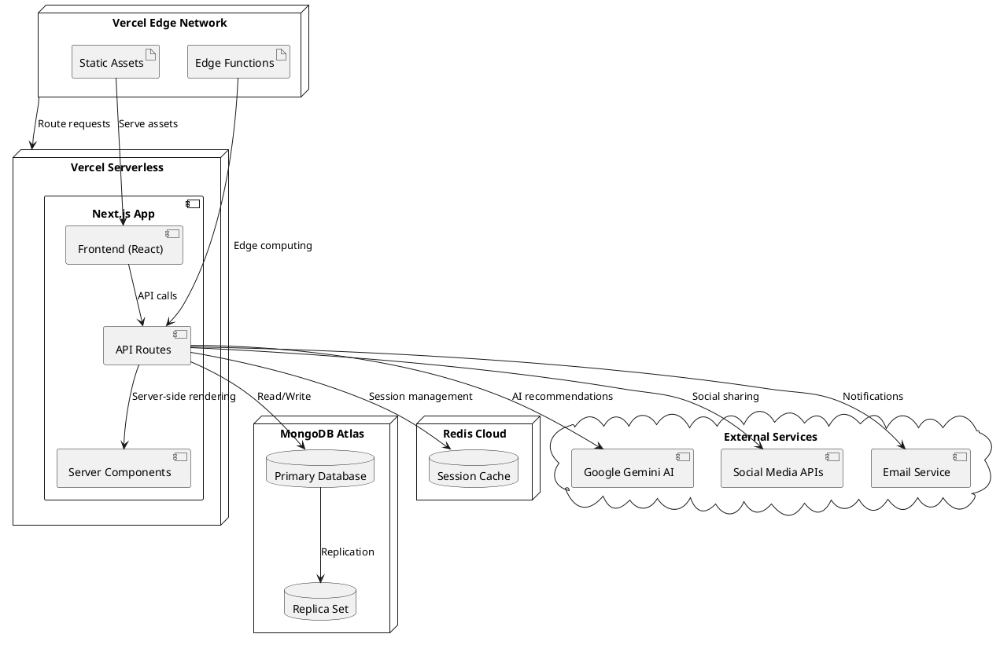

### 9.2 Development Environment

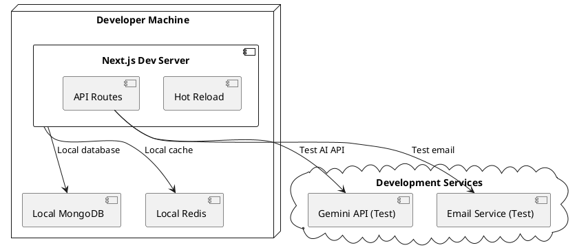

---

## 10. DATA FLOW DIAGRAM

### 10.1 DFD Level 0 (Context Diagram)

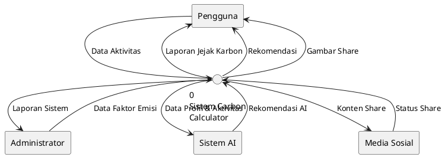

### 10.2 DFD Level 1 (Functional Decomposition)

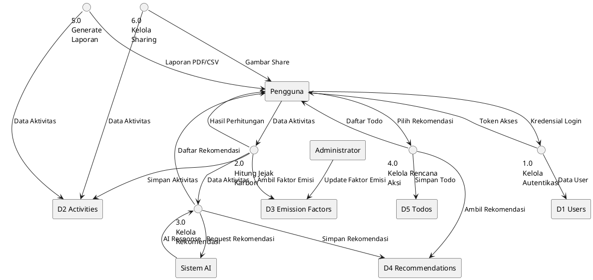

### 10.3 DFD Level 2 - Proses Hitung Jejak Karbon

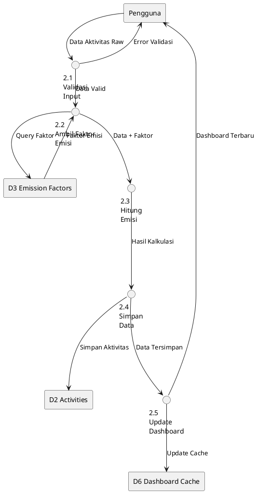

---

## 11. WIREFRAME

### 11.1 Wireframe - Halaman Dashboard

```
+----------------------------------------------------------+
|  [LOGO] Carbon Calculator    [Profile] [Notifications]  |
+----------------------------------------------------------+
| Dashboard | Calculator | Reports | Social | Settings    |
+----------------------------------------------------------+
|                                                          |
| Welcome back, [User Name]!                              |
|                                                          |
| +----------------+ +----------------+ +----------------+ |
| | Today's Carbon | | This Month     | | Total Saved    | |
| | 12.5 kg CO2e   | | 340 kg CO2e    | | 89 kg CO2e     | |
| | +2.1 from      | | -15% from      | | 🏆 Level 3     | |
| | yesterday      | | last month     | | Eco Warrior    | |
| +----------------+ +----------------+ +----------------+ |
|                                                          |
| +------------------------+ +---------------------------+ |
| | Emission Breakdown     | | Recent Activities         | |
| |                        | |                           | |
| | [PIE CHART]           | | • Car trip: 5.2 kg CO2e  | |
| | • Transport: 45%       | | • Electricity: 3.1 kg    | |
| | • Energy: 30%          | | • Lunch: 2.8 kg CO2e     | |
| | • Food: 20%            | | • Waste: 1.4 kg CO2e     | |
| | • Waste: 5%            | |                           | |
| +------------------------+ | [View All Activities]     | |
|                            +---------------------------+ |
| +------------------------------------------------------ |
| | AI Recommendations                    [Get More]      | |
| |                                                       | |
| | 🚗 Try carpooling 2x/week → Save 15 kg CO2e/month   | |
| | 💡 Switch to LED bulbs → Save 8 kg CO2e/month       | |
| | 🥗 One meatless day/week → Save 12 kg CO2e/month    | |
| +------------------------------------------------------ |
|                                                          |
| +------------------------+ +---------------------------+ |
| | Monthly Trend          | | Action Items (3/7)        | |
| |                        | |                           | |
| | [LINE CHART]          | | ✅ Install LED bulbs      | |
| | Jan: 450 kg           | | ⏳ Plan carpool schedule  | |
| | Feb: 420 kg           | | ⏳ Research solar panels  | |
| | Mar: 380 kg           | |                           | |
| +------------------------+ +---------------------------+ |
+----------------------------------------------------------+
```

### 11.2 Wireframe - Halaman Calculator

```
+----------------------------------------------------------+
|  [LOGO] Carbon Calculator    [Profile] [Notifications]  |
+----------------------------------------------------------+
| Dashboard | Calculator | Reports | Social | Settings    |
+----------------------------------------------------------+
|                                                          |
| Carbon Footprint Calculator                             |
|                                                          |
| +------------------------------------------------------+ |
| | [Transportation] [Energy] [Food] [Waste]             | |
| +------------------------------------------------------+ |
|                                                          |
| Transportation Activities                                |
|                                                          |
| +------------------------+ +---------------------------+ |
| | Activity Type          | | Details                   | |
| | [Dropdown: Car]        | |                           | |
| |                        | | Distance: [____] km       | |
| | Fuel Type              | | Fuel Type: [Dropdown]     | |
| | [Dropdown: Gasoline]   | | Passengers: [____]        | |
| |                        | |                           | |
| | [Add Activity]         | | Estimated: 5.2 kg CO2e   | |
| +------------------------+ +---------------------------+ |
|                                                          |
| Today's Activities                                       |
| +------------------------------------------------------+ |
| | Time  | Activity      | Amount    | Emission | [Edit] | |
| |-------|---------------|-----------|----------|--------| |
| | 08:00 | Car (10km)    | Gasoline  | 2.3 kg   | [✏️]   | |
| | 12:00 | Lunch (Beef)  | 200g      | 4.1 kg   | [✏️]   | |
| | 18:00 | Electricity   | 15 kWh    | 1.8 kg   | [✏️]   | |
| +------------------------------------------------------+ |
|                                                          |
| Total Today: 8.2 kg CO2e                               |
| [Save & Continue] [View Recommendations]                |
+----------------------------------------------------------+
```

### 11.3 Wireframe - Halaman Recommendations

```
+----------------------------------------------------------+
|  [LOGO] Carbon Calculator    [Profile] [Notifications]  |
+----------------------------------------------------------+
| Dashboard | Calculator | Reports | Social | Settings    |
+----------------------------------------------------------+
|                                                          |
| AI-Powered Recommendations                               |
|                                                          |
| Based on your carbon footprint analysis, here are       |
| personalized suggestions to reduce your emissions:      |
|                                                          |
| +------------------------------------------------------+ |
| | 🚗 Transportation (45% of your emissions)            | |
| |                                                      | |
| | EASY (2-5 kg CO2e reduction/month)                   | |
| | • Walk or bike for trips under 2km                  | |
| | • Combine errands into one trip                      | |
| | • Work from home 1 extra day per week               | |
| |                                                      | |
| | MEDIUM (8-15 kg CO2e reduction/month)                | |
| | • Use public transport 3x per week                  | |
| | • Join a carpool group                              | |
| | • Plan vacation closer to home                       | |
| |                                                      | |
| | HARD (20+ kg CO2e reduction/month)                   | |
| | • Switch to electric or hybrid vehicle              | |
| | • Move closer to work/school                        | |
| +------------------------------------------------------+ |
|                                                          |
| +------------------------------------------------------+ |
| | 💡 Energy (30% of your emissions)                    | |
| |                                                      | |
| | EASY (3-6 kg CO2e reduction/month)                   | |
| | • Switch to LED bulbs                               | |
| | • Unplug devices when not in use                    | |
| | • Lower thermostat by 2°C                          | |
| |                                                      | |
| | [Create Action Plan] [Mark as Implemented]           | |
| +------------------------------------------------------+ |
|                                                          |
| [Generate New Recommendations] [View My Action Plans]   |
+----------------------------------------------------------+
```

### 11.4 Wireframe - Halaman Action Plans (Todo)

```
+----------------------------------------------------------+
|  [LOGO] Carbon Calculator    [Profile] [Notifications]  |
+----------------------------------------------------------+
| Dashboard | Calculator | Reports | Social | Settings    |
+----------------------------------------------------------+
|                                                          |
| My Action Plans                                          |
|                                                          |
| Progress: 3 of 7 completed (43%)                        |
| [████████░░░░░░░░░░░] Estimated savings: 45 kg CO2e/month|
|                                                          |
| +------------------------------------------------------+ |
| | Filter: [All] [Pending] [Completed] [High Priority]  | |
| +------------------------------------------------------+ |
|                                                          |
| HIGH PRIORITY                                            |
| +------------------------------------------------------+ |
| | ⏳ Install LED bulbs in living room                   | |
| |    Target: Dec 15, 2024 | Est. saving: 8 kg CO2e    | |
| |    [Mark Complete] [Edit] [Delete]                   | |
| +------------------------------------------------------+ |
| | ⏳ Research carpool options                           | |
| |    Target: Dec 20, 2024 | Est. saving: 15 kg CO2e   | |
| |    [Mark Complete] [Edit] [Delete]                   | |
| +------------------------------------------------------+ |
|                                                          |
| MEDIUM PRIORITY                                          |
| +------------------------------------------------------+ |
| | ⏳ Plan meatless Monday meals                         | |
| |    Target: Dec 31, 2024 | Est. saving: 12 kg CO2e   | |
| |    [Mark Complete] [Edit] [Delete]                   | |
| +------------------------------------------------------+ |
|                                                          |
| COMPLETED ✅                                             |
| +------------------------------------------------------+ |
| | ✅ Switch to reusable water bottle                    | |
| |    Completed: Dec 1, 2024 | Saved: 3 kg CO2e        | |
| +------------------------------------------------------+ |
| | ✅ Start composting food waste                        | |
| |    Completed: Nov 28, 2024 | Saved: 5 kg CO2e       | |
| +------------------------------------------------------+ |
|                                                          |
| [Add New Action] [View Recommendations]                  |
+----------------------------------------------------------+
```

### 11.5 Wireframe - Halaman Share/Social

```
+----------------------------------------------------------+
|  [LOGO] Carbon Calculator    [Profile] [Notifications]  |
+----------------------------------------------------------+
| Dashboard | Calculator | Reports | Social | Settings    |
+----------------------------------------------------------+
|                                                          |
| Share Your Impact                                        |
|                                                          |
| +------------------------+ +---------------------------+ |
| | Share Templates        | | Preview                   | |
| |                        | |                           | |
| | [Daily Summary]        | | +---------------------+   | |
| | [Monthly Report]       | | | 🌱 My Carbon Impact |   | |
| | [Achievement Badge]    | | |                     |   | |
| | [Profile Card]         | | | Today: 8.2 kg CO2e  |   | |
| |                        | | | This Month: 245 kg  |   | |
| | Customize:             | | | Saved: 67 kg CO2e   |   | |
| | Background: [Green]    | | |                     |   | |
| | Style: [Modern]        | | | 🏆 Eco Warrior L3   |   | |
| | Include: [✓] Stats     | | | Join me at CarbCalc |   | |
| |          [✓] Badge     | | +---------------------+   | |
| |          [✓] Message   | |                           | |
| +------------------------+ +---------------------------+ |
|                                                          |
| Personal Message (Optional)                              |
| +------------------------------------------------------+ |
| | Just reduced my carbon footprint by 15% this month! | |
| | Small changes make a big difference 🌍              | |
| +------------------------------------------------------+ |
|                                                          |
| Share To:                                                |
| +------------------------------------------------------+ |
| | [📱 Twitter/X] [📷 Instagram] [💾 Download Image]    | |
| | [📧 Email] [🔗 Copy Link] [📋 Copy to Clipboard]     | |
| +------------------------------------------------------+ |
|                                                          |
| Recent Shares                                            |
| +------------------------------------------------------+ |
| | Dec 10: Monthly Report → Twitter (15 likes)          | |
| | Dec 8: Achievement Badge → Instagram (23 likes)      | |
| | Dec 5: Daily Summary → Twitter (8 likes)             | |
| +------------------------------------------------------+ |
+----------------------------------------------------------+
```

---

## 12. KESIMPULAN

### 12.1 Ringkasan Analisis

Dokumentasi sistem Carbon Calculator App (CarbCalc) telah disusun secara komprehensif dengan menggunakan berbagai diagram UML dan metodologi analisis sistem. Sistem ini dirancang untuk mengatasi masalah pelacakan jejak karbon yang manual dan tidak terintegrasi menjadi solusi digital yang otomatis dan user-friendly.

### 12.2 Keunggulan Sistem TO-BE

1. **Otomatisasi Proses**: Perhitungan jejak karbon otomatis dengan faktor emisi terkini
2. **Integrasi AI**: Rekomendasi personal menggunakan Google Gemini AI
3. **Gamifikasi**: Sistem poin dan achievement untuk motivasi berkelanjutan
4. **Visualisasi Data**: Dashboard interaktif dengan chart dan analytics
5. **Social Sharing**: Kemudahan berbagi pencapaian ke media sosial
6. **Responsive Design**: Akses optimal di berbagai perangkat

### 12.3 Implementasi Rekomendasi

Berdasarkan feedback review presentasi, sistem telah diperbaiki dengan:

1. ✅ **Proses bisnis digambarkan**: AS-IS dan TO-BE dijelaskan detail
2. ✅ **Use case menggunakan kata kerja**: "Mengelola", "Menghitung", "Melihat"
3. ✅ **Include/Extend/Generalization**: Diterapkan dalam diagram use case
4. ✅ **Diagram mudah dibaca**: Menggunakan PlantUML dengan struktur jelas
5. ✅ **Notasi sequence benar**: Mengikuti standar UML
6. ✅ **Proses bisnis melibatkan sistem**: Interaksi sistem-aktor jelas
7. ✅ **Activity dan wireframe konsisten**: Penamaan dan flow selaras
8. ✅ **Pemberian kode**: Setiap use case, tabel, field memiliki kode
9. ✅ **Penamaan konsisten**: Standar penamaan diterapkan di semua diagram

### 12.4 Teknologi dan Arsitektur

Sistem menggunakan arsitektur modern dengan:
- **Frontend**: Next.js 14, React 18, TypeScript, Tailwind CSS
- **Backend**: Next.js API Routes, MongoDB, Redis
- **AI Integration**: Google Gemini API
- **Deployment**: Vercel dengan edge computing
- **Security**: NextAuth.js, HTTPS, data encryption

### 12.5 Roadmap Pengembangan

1. **Phase 1**: Core features (Calculator, Dashboard, Basic Recommendations)
2. **Phase 2**: AI Integration, Social Sharing, Gamification
3. **Phase 3**: Advanced Analytics, Mobile App, API untuk third-party
4. **Phase 4**: Machine Learning, Predictive Analytics, IoT Integration

Dokumentasi ini menjadi foundation yang solid untuk pengembangan sistem Carbon Calculator App yang dapat membantu individu dan organisasi dalam upaya mengurangi jejak karbon mereka secara berkelanjutan.

---

**Dokumen ini disusun sebagai panduan lengkap untuk pengembangan sistem dan dapat digunakan sebagai referensi oleh tim development, stakeholder, dan pihak terkait lainnya.**