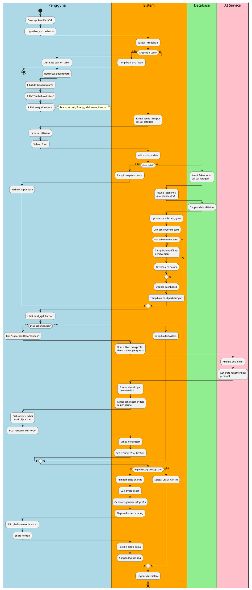
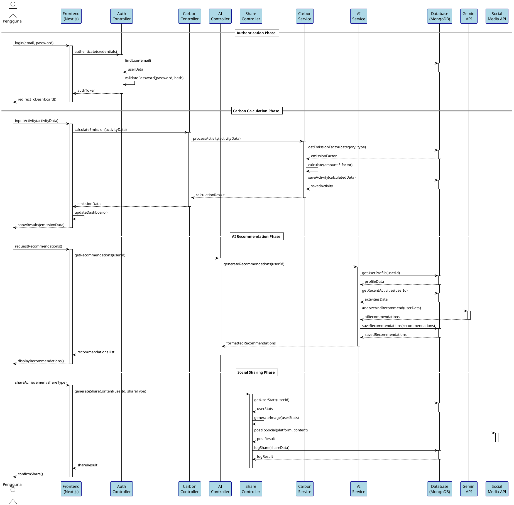

# PLANTUML DIAGRAMS - CARBON CALCULATOR APP

## Cara Menggunakan Diagram PlantUML

1. Install PlantUML extension di VS Code
2. Copy kode diagram ke file .puml
3. Preview dengan Ctrl+Shift+P → "PlantUML: Preview Current Diagram"

---

## 1. USE CASE DIAGRAM LENGKAP

```plantuml
@startuml UseCase_CarbCalc_Complete
!theme plain
skinparam usecase {
    BackgroundColor LightBlue
    BorderColor DarkBlue
    ArrowColor Black
}

left to right direction

actor "Pengguna\n(User)" as User #LightGreen
actor "Administrator\n(Admin)" as Admin #Orange  
actor "Peneliti\n(Researcher)" as Researcher #Yellow
actor "Sistem AI\n(AI System)" as AI #LightPink

rectangle "Carbon Calculator System" {
  
  package "Authentication" {
    usecase "UC-01\nMengelola Autentikasi" as UC01
    usecase "UC-01.1\nLogin Pengguna" as UC011
    usecase "UC-01.2\nRegistrasi Pengguna" as UC012
    usecase "UC-01.3\nReset Password" as UC013
    usecase "UC-01.4\nLogout Pengguna" as UC014
  }
  
  package "Profile Management" {
    usecase "UC-02\nMengelola Profil" as UC02
    usecase "UC-02.1\nLihat Profil" as UC021
    usecase "UC-02.2\nUbah Profil" as UC022
    usecase "UC-02.3\nKelola Achievement" as UC023
  }
  
  package "Carbon Calculation" {
    usecase "UC-03\nMenghitung Jejak Karbon" as UC03
    usecase "UC-03.1\nInput Data Transportasi" as UC031
    usecase "UC-03.2\nInput Data Energi" as UC032
    usecase "UC-03.3\nInput Data Makanan" as UC033
    usecase "UC-03.4\nInput Data Limbah" as UC034
    usecase "UC-03.5\nKalkulasi Total Emisi" as UC035
  }
  
  package "Data Management" {
    usecase "UC-04\nMengelola Data Aktivitas" as UC04
    usecase "UC-04.1\nTambah Data Aktivitas" as UC041
    usecase "UC-04.2\nLihat Data Aktivitas" as UC042
    usecase "UC-04.3\nUbah Data Aktivitas" as UC043
    usecase "UC-04.4\nHapus Data Aktivitas" as UC044
  }
  
  package "Visualization" {
    usecase "UC-05\nMelihat Visualisasi Data" as UC05
    usecase "UC-05.1\nLihat Dashboard" as UC051
    usecase "UC-05.2\nLihat Chart Emisi" as UC052
    usecase "UC-05.3\nGenerate Laporan" as UC053
  }
  
  package "AI Recommendations" {
    usecase "UC-06\nMengelola Rekomendasi" as UC06
    usecase "UC-06.1\nGenerate Rekomendasi AI" as UC061
    usecase "UC-06.2\nLihat Rekomendasi" as UC062
    usecase "UC-06.3\nTandai Rekomendasi Selesai" as UC063
  }
  
  package "Action Planning" {
    usecase "UC-07\nMengelola Rencana Aksi" as UC07
    usecase "UC-07.1\nBuat Todo dari Rekomendasi" as UC071
    usecase "UC-07.2\nTandai Todo Selesai" as UC072
    usecase "UC-07.3\nHapus Todo" as UC073
    usecase "UC-07.4\nLihat Progress Todo" as UC074
  }
  
  package "Social Sharing" {
    usecase "UC-08\nBerbagi ke Media Sosial" as UC08
    usecase "UC-08.1\nGenerate Share Image" as UC081
    usecase "UC-08.2\nShare ke Twitter" as UC082
    usecase "UC-08.3\nShare ke Instagram" as UC083
    usecase "UC-08.4\nDownload Infografis" as UC084
  }
  
  package "System Administration" {
    usecase "UC-09\nMengelola Sistem" as UC09
    usecase "UC-09.1\nKelola Pengguna" as UC091
    usecase "UC-09.2\nKelola Faktor Emisi" as UC092
    usecase "UC-09.3\nLihat Log Sistem" as UC093
  }
  
  package "Research Access" {
    usecase "UC-10\nMengakses Data Penelitian" as UC10
    usecase "UC-10.1\nLihat Data Agregat" as UC101
    usecase "UC-10.2\nExport Data Riset" as UC102
  }
}

' Actor relationships
User --> UC01
User --> UC02
User --> UC03
User --> UC04
User --> UC05
User --> UC06
User --> UC07
User --> UC08

Admin --> UC09
Admin --> UC01 : "admin login"

Researcher --> UC10
Researcher --> UC01 : "researcher login"

AI --> UC06 : "provide recommendations"

' Include relationships
UC01 ..> UC011 : <<include>>
UC01 ..> UC012 : <<include>>
UC01 ..> UC013 : <<include>>
UC01 ..> UC014 : <<include>>

UC02 ..> UC021 : <<include>>
UC02 ..> UC022 : <<include>>
UC02 ..> UC023 : <<include>>

UC03 ..> UC031 : <<include>>
UC03 ..> UC032 : <<include>>
UC03 ..> UC033 : <<include>>
UC03 ..> UC034 : <<include>>
UC03 ..> UC035 : <<include>>

UC04 ..> UC041 : <<include>>
UC04 ..> UC042 : <<include>>
UC04 ..> UC043 : <<include>>
UC04 ..> UC044 : <<include>>

UC05 ..> UC051 : <<include>>
UC05 ..> UC052 : <<include>>
UC05 ..> UC053 : <<include>>

UC06 ..> UC061 : <<include>>
UC06 ..> UC062 : <<include>>
UC06 ..> UC063 : <<include>>

UC07 ..> UC071 : <<include>>
UC07 ..> UC072 : <<include>>
UC07 ..> UC073 : <<include>>
UC07 ..> UC074 : <<include>>

UC08 ..> UC081 : <<include>>
UC08 ..> UC082 : <<include>>
UC08 ..> UC083 : <<include>>
UC08 ..> UC084 : <<include>>

UC09 ..> UC091 : <<include>>
UC09 ..> UC092 : <<include>>
UC09 ..> UC093 : <<include>>

UC10 ..> UC101 : <<include>>
UC10 ..> UC102 : <<include>>

' Extend relationships
UC06 ..> UC07 : <<extend>>
UC05 ..> UC08 : <<extend>>
UC03 ..> UC04 : <<extend>>

' Generalization
UC011 <|-- UC01 : "specialized login"
UC091 <|-- UC09 : "user management"

@enduml
```



---

## 2. ACTIVITY DIAGRAM - PROSES BISNIS LENGKAP



---

## 3. SEQUENCE DIAGRAM - COMPLETE FLOW



---

## 4. CLASS DIAGRAM - COMPLETE SYSTEM

```plantuml
@startuml ClassDiagram_CompleteSystem
!theme plain

package "Domain Models" {
  class User {
    +id: String
    +email: String
    +passwordHash: String
    +name: String
    +role: UserRole
    +profilePicture: String
    +ecoPoints: Integer
    +createdAt: Date
    +updatedAt: Date
    --
    +authenticate(password: String): Boolean
    +updateProfile(data: Object): Boolean
    +addEcoPoints(points: Integer): void
    +getTotalEmissions(): Double
    +getMonthlyEmissions(): Double
  }

  enum UserRole {
    USER
    PREMIUM
    GOVERNMENT
    ADMIN
  }

  class UserProfile {
    +userId: String
    +location: String
    +householdSize: Integer
    +incomeRange: String
    +preferences: JSON
    +sustainabilityGoals: String[]
    --
    +updateLocation(location: String): Boolean
    +setPreferences(prefs: JSON): Boolean
    +addGoal(goal: String): Boolean
  }

  class EmissionActivity {
    +id: String
    +userId: String
    +category: ActivityCategory
    +type: String
    +amount: Double
    +unit: String
    +emissionValue: Double
    +activityDate: Date
    +notes: String
    +createdAt: Date
    --
    +calculateEmission(factor: EmissionFactor): Double
    +validate(): ValidationResult
    +updateAmount(newAmount: Double): Boolean
  }

  enum ActivityCategory {
    TRANSPORTATION
    ENERGY
    FOOD
    WASTE
  }

  class EmissionFactor {
    +id: String
    +category: ActivityCategory
    +type: String
    +factorValue: Double
    +unit: String
    +source: String
    +isActive: Boolean
    +validFrom: Date
    +validTo: Date
    --
    +isValidForDate(date: Date): Boolean
    +getFactorForAmount(amount: Double): Double
  }

  class Recommendation {
    +id: String
    +userId: String
    +title: String
    +description: String
    +category: ActivityCategory
    +difficulty: DifficultyLevel
    +estimatedReduction: Double
    +priority: Integer
    +isImplemented: Boolean
    +implementedAt: Date
    +createdAt: Date
    --
    +markAsImplemented(): Boolean
    +calculateImpact(): Double
  }

  enum DifficultyLevel {
    EASY
    MEDIUM
    HARD
  }

  class TodoItem {
    +id: String
    +userId: String
    +recommendationId: String
    +title: String
    +description: String
    +priority: Priority
    +status: TodoStatus
    +targetDate: Date
    +completedAt: Date
    +reminderSet: Boolean
    --
    +markAsCompleted(): Boolean
    +updatePriority(priority: Priority): Boolean
    +setReminder(date: Date): Boolean
    +calculateProgress(): Double
  }

  enum Priority {
    LOW
    MEDIUM
    HIGH
    URGENT
  }

  enum TodoStatus {
    PENDING
    IN_PROGRESS
    COMPLETED
    CANCELLED
    OVERDUE
  }

  class Achievement {
    +id: String
    +name: String
    +description: String
    +badgeIcon: String
    +category: String
    +criteria: JSON
    +points: Integer
    +rarity: Rarity
    --
    +checkCriteria(userData: Object): Boolean
    +awardToUser(userId: String): UserAchievement
  }

  enum Rarity {
    COMMON
    RARE
    EPIC
    LEGENDARY
  }

  class UserAchievement {
    +userId: String
    +achievementId: String
    +earnedAt: Date
    +isVisible: Boolean
    +progress: Double
    --
    +toggleVisibility(): Boolean
    +getDisplayData(): Object
  }

  class ShareContent {
    +id: String
    +userId: String
    +type: ShareType
    +contentData: JSON
    +imageUrl: String
    +platform: String
    +shareUrl: String
    +likes: Integer
    +shares: Integer
    +createdAt: Date
    --
    +generateImage(): String
    +shareToSocial(platform: String): Boolean
    +trackEngagement(): Object
  }

  enum ShareType {
    DAILY_SUMMARY
    WEEKLY_REPORT
    MONTHLY_REPORT
    ACHIEVEMENT_BADGE
    PROFILE_CARD
    MILESTONE
  }
}

package "Service Layer" {
  interface ICarbonService {
    +calculateEmission(activityData: Object): Double
    +saveActivity(activityData: Object): EmissionActivity
    +getActivities(userId: String, filters: Object): EmissionActivity[]
    +updateActivity(id: String, data: Object): Boolean
    +deleteActivity(id: String): Boolean
  }

  class CarbonService {
    -emissionFactorRepo: EmissionFactorRepository
    -activityRepo: ActivityRepository
    -achievementService: AchievementService
    --
    +calculateEmission(activityData: Object): Double
    +saveActivity(activityData: Object): EmissionActivity
    +getActivities(userId: String, filters: Object): EmissionActivity[]
    +validateActivityData(data: Object): ValidationResult
    +getEmissionTrends(userId: String, period: String): TrendData
  }

  interface IAIService {
    +generateRecommendations(userId: String): Recommendation[]
    +analyzeEmissionPattern(activities: EmissionActivity[]): AnalysisResult
    +updateRecommendations(userId: String): Boolean
  }

  class AIService {
    -geminiClient: GeminiClient
    -recommendationRepo: RecommendationRepository
    -userRepo: UserRepository
    --
    +generateRecommendations(userId: String): Recommendation[]
    +analyzeEmissionPattern(activities: EmissionActivity[]): AnalysisResult
    +formatAIResponse(response: String): Recommendation[]
    +calculateReductionPotential(userData: Object): Double
  }

  class TodoService {
    -todoRepo: TodoRepository
    -notificationService: NotificationService
    -recommendationRepo: RecommendationRepository
    --
    +createTodoFromRecommendation(recId: String): TodoItem
    +updateTodoStatus(id: String, status: TodoStatus): Boolean
    +getTodos(userId: String, filters: Object): TodoItem[]
    +calculateUserProgress(userId: String): ProgressData
    +setReminders(todoId: String, reminderDate: Date): Boolean
  }

  class ShareService {
    -canvasService: CanvasService
    -socialMediaService: SocialMediaService
    -userRepo: UserRepository
    --
    +generateShareImage(userId: String, type: ShareType): String
    +shareToSocial(platform: String, content: Object): Boolean
    +getShareTemplates(): Template[]
    +trackShareEngagement(shareId: String): EngagementData
  }

  class AchievementService {
    -achievementRepo: AchievementRepository
    -userAchievementRepo: UserAchievementRepository
    -notificationService: NotificationService
    --
    +checkAndAwardAchievements(userId: String): UserAchievement[]
    +getUserAchievements(userId: String): UserAchievement[]
    +calculateProgress(userId: String, achievementId: String): Double
    +getAvailableAchievements(): Achievement[]
  }
}

package "Repository Layer" {
  interface IUserRepository {
    +findById(id: String): User
    +findByEmail(email: String): User
    +save(user: User): User
    +update(id: String, data: Object): Boolean
    +delete(id: String): Boolean
  }

  class UserRepository {
    -database: Database
    --
    +findById(id: String): User
    +findByEmail(email: String): User
    +save(user: User): User
    +update(id: String, data: Object): Boolean
    +getUserStats(userId: String): UserStats
  }

  class ActivityRepository {
    -database: Database
    --
    +save(activity: EmissionActivity): EmissionActivity
    +findByUserId(userId: String): EmissionActivity[]
    +findByDateRange(userId: String, start: Date, end: Date): EmissionActivity[]
    +update(id: String, data: Object): Boolean
    +delete(id: String): Boolean
    +getAggregatedData(userId: String, period: String): AggregateData
  }

  class RecommendationRepository {
    -database: Database
    --
    +save(recommendation: Recommendation): Recommendation
    +findByUserId(userId: String): Recommendation[]
    +markAsImplemented(id: String): Boolean
    +findByCategory(category: ActivityCategory): Recommendation[]
  }

  class TodoRepository {
    -database: Database
    --
    +save(todo: TodoItem): TodoItem
    +findByUserId(userId: String): TodoItem[]
    +updateStatus(id: String, status: TodoStatus): Boolean
    +findOverdueTodos(): TodoItem[]
    +getProgressStats(userId: String): ProgressStats
  }
}

' Relationships
User ||--|| UserProfile : "1:1"
User ||--o{ EmissionActivity : "1:N"
User ||--o{ Recommendation : "1:N"
User ||--o{ TodoItem : "1:N"
User ||--o{ UserAchievement : "1:N"
User ||--o{ ShareContent : "1:N"

EmissionActivity }o--|| EmissionFactor : "N:1"
Recommendation ||--o{ TodoItem : "1:N"
Achievement ||--o{ UserAchievement : "1:N"

' Service implementations
CarbonService ..|> ICarbonService
AIService ..|> IAIService
UserRepository ..|> IUserRepository

' Service dependencies
CarbonService --> ActivityRepository
CarbonService --> EmissionFactorRepository
AIService --> RecommendationRepository
AIService --> UserRepository
TodoService --> TodoRepository
ShareService --> UserRepository
AchievementService --> AchievementRepository

@enduml
```



---

## 5. ERD - DETAILED DATABASE SCHEMA

```plantuml
@startuml ERD_DetailedSchema
!theme plain
!define table(x) class x << (T,#FFAAAA) >>
!define pk(x) <u><b>x</b></u>
!define fk(x) <i>x</i>
!define idx(x) x

' Main Tables
table(users) {
  pk(id) : VARCHAR(36) NOT NULL
  idx(email) : VARCHAR(255) UNIQUE NOT NULL
  password_hash : VARCHAR(255) NOT NULL
  name : VARCHAR(100) NOT NULL
  role : ENUM('USER','PREMIUM','GOVERNMENT','ADMIN') DEFAULT 'USER'
  profile_picture : VARCHAR(500)
  eco_points : INT DEFAULT 0
  is_active : BOOLEAN DEFAULT TRUE
  email_verified : BOOLEAN DEFAULT FALSE
  last_login : TIMESTAMP
  created_at : TIMESTAMP DEFAULT CURRENT_TIMESTAMP
  updated_at : TIMESTAMP DEFAULT CURRENT_TIMESTAMP ON UPDATE CURRENT_TIMESTAMP
}

table(user_profiles) {
  pk(user_id) : VARCHAR(36) NOT NULL
  location : VARCHAR(100)
  household_size : INT DEFAULT 1
  income_range : VARCHAR(50)
  preferences : JSON
  sustainability_goals : JSON
  carbon_target : DECIMAL(10,2)
  notification_settings : JSON
  privacy_settings : JSON
  created_at : TIMESTAMP DEFAULT CURRENT_TIMESTAMP
  updated_at : TIMESTAMP DEFAULT CURRENT_TIMESTAMP ON UPDATE CURRENT_TIMESTAMP
}

table(emission_factors) {
  pk(id) : VARCHAR(36) NOT NULL
  category : ENUM('TRANSPORTATION','ENERGY','FOOD','WASTE') NOT NULL
  type : VARCHAR(100) NOT NULL
  subtype : VARCHAR(100)
  factor_value : DECIMAL(12,8) NOT NULL
  unit : VARCHAR(50) NOT NULL
  source : VARCHAR(200) NOT NULL
  region : VARCHAR(100) DEFAULT 'GLOBAL'
  is_active : BOOLEAN DEFAULT TRUE
  valid_from : DATE NOT NULL
  valid_to : DATE
  confidence_level : DECIMAL(3,2) DEFAULT 1.00
  created_at : TIMESTAMP DEFAULT CURRENT_TIMESTAMP
  updated_at : TIMESTAMP DEFAULT CURRENT_TIMESTAMP ON UPDATE CURRENT_TIMESTAMP
}

table(emission_activities) {
  pk(id) : VARCHAR(36) NOT NULL
  fk(user_id) : VARCHAR(36) NOT NULL
  fk(emission_factor_id) : VARCHAR(36) NOT NULL
  category : ENUM('TRANSPORTATION','ENERGY','FOOD','WASTE') NOT NULL
  type : VARCHAR(100) NOT NULL
  subtype : VARCHAR(100)
  amount : DECIMAL(12,4) NOT NULL
  unit : VARCHAR(50) NOT NULL
  emission_value : DECIMAL(12,8) NOT NULL
  activity_date : DATE NOT NULL
  location : VARCHAR(100)
  notes : TEXT
  confidence_score : DECIMAL(3,2) DEFAULT 1.00
  is_estimated : BOOLEAN DEFAULT FALSE
  created_at : TIMESTAMP DEFAULT CURRENT_TIMESTAMP
  updated_at : TIMESTAMP DEFAULT CURRENT_TIMESTAMP ON UPDATE CURRENT_TIMESTAMP
}

table(recommendations) {
  pk(id) : VARCHAR(36) NOT NULL
  fk(user_id) : VARCHAR(36) NOT NULL
  title : VARCHAR(200) NOT NULL
  description : TEXT NOT NULL
  category : ENUM('TRANSPORTATION','ENERGY','FOOD','WASTE') NOT NULL
  difficulty : ENUM('EASY','MEDIUM','HARD') NOT NULL
  estimated_reduction : DECIMAL(10,4) NOT NULL
  estimated_cost : DECIMAL(10,2)
  time_to_implement : INT
  priority_score : INT DEFAULT 50
  is_implemented : BOOLEAN DEFAULT FALSE
  implemented_at : TIMESTAMP NULL
  ai_confidence : DECIMAL(3,2) DEFAULT 1.00
  source : VARCHAR(100) DEFAULT 'AI'
  created_at : TIMESTAMP DEFAULT CURRENT_TIMESTAMP
  updated_at : TIMESTAMP DEFAULT CURRENT_TIMESTAMP ON UPDATE CURRENT_TIMESTAMP
}

table(todo_items) {
  pk(id) : VARCHAR(36) NOT NULL
  fk(user_id) : VARCHAR(36) NOT NULL
  fk(recommendation_id) : VARCHAR(36)
  title : VARCHAR(200) NOT NULL
  description : TEXT
  priority : ENUM('LOW','MEDIUM','HIGH','URGENT') DEFAULT 'MEDIUM'
  status : ENUM('PENDING','IN_PROGRESS','COMPLETED','CANCELLED','OVERDUE') DEFAULT 'PENDING'
  target_date : DATE
  completed_at : TIMESTAMP NULL
  reminder_date : TIMESTAMP NULL
  estimated_time : INT
  actual_time : INT
  notes : TEXT
  created_at : TIMESTAMP DEFAULT CURRENT_TIMESTAMP
  updated_at : TIMESTAMP DEFAULT CURRENT_TIMESTAMP ON UPDATE CURRENT_TIMESTAMP
}

table(achievements) {
  pk(id) : VARCHAR(36) NOT NULL
  name : VARCHAR(100) NOT NULL UNIQUE
  description : TEXT NOT NULL
  badge_icon : VARCHAR(500) NOT NULL
  category : VARCHAR(50) NOT NULL
  criteria : JSON NOT NULL
  points : INT NOT NULL DEFAULT 0
  rarity : ENUM('COMMON','RARE','EPIC','LEGENDARY') DEFAULT 'COMMON'
  is_active : BOOLEAN DEFAULT TRUE
  created_at : TIMESTAMP DEFAULT CURRENT_TIMESTAMP
}

table(user_achievements) {
  pk(user_id, achievement_id) : VARCHAR(36) NOT NULL
  fk(user_id) : VARCHAR(36) NOT NULL
  fk(achievement_id) : VARCHAR(36) NOT NULL
  earned_at : TIMESTAMP DEFAULT CURRENT_TIMESTAMP
  progress : DECIMAL(5,2) DEFAULT 100.00
  is_visible : BOOLEAN DEFAULT TRUE
  notification_sent : BOOLEAN DEFAULT FALSE
}

table(share_contents) {
  pk(id) : VARCHAR(36) NOT NULL
  fk(user_id) : VARCHAR(36) NOT NULL
  type : ENUM('DAILY_SUMMARY','WEEKLY_REPORT','MONTHLY_REPORT','ACHIEVEMENT_BADGE','PROFILE_CARD','MILESTONE') NOT NULL
  title : VARCHAR(200) NOT NULL
  content_data : JSON NOT NULL
  image_url : VARCHAR(500)
  platform : VARCHAR(50)
  share_url : VARCHAR(500)
  likes_count : INT DEFAULT 0
  shares_count : INT DEFAULT 0
  views_count : INT DEFAULT 0
  is_public : BOOLEAN DEFAULT TRUE
  created_at : TIMESTAMP DEFAULT CURRENT_TIMESTAMP
}

table(system_logs) {
  pk(id) : VARCHAR(36) NOT NULL
  fk(user_id) : VARCHAR(36)
  action : VARCHAR(100) NOT NULL
  entity_type : VARCHAR(50)
  entity_id : VARCHAR(36)
  details : JSON
  ip_address : VARCHAR(45)
  user_agent : TEXT
  created_at : TIMESTAMP DEFAULT CURRENT_TIMESTAMP
}

table(notification_queue) {
  pk(id) : VARCHAR(36) NOT NULL
  fk(user_id) : VARCHAR(36) NOT NULL
  type : VARCHAR(50) NOT NULL
  title : VARCHAR(200) NOT NULL
  message : TEXT NOT NULL
  data : JSON
  status : ENUM('PENDING','SENT','FAILED','CANCELLED') DEFAULT 'PENDING'
  scheduled_at : TIMESTAMP
  sent_at : TIMESTAMP NULL
  created_at : TIMESTAMP DEFAULT CURRENT_TIMESTAMP
}

' Relationships with cardinality
users ||--|| user_profiles : "1:1"
users ||--o{ emission_activities : "1:N"
users ||--o{ recommendations : "1:N"
users ||--o{ todo_items : "1:N"
users ||--o{ user_achievements : "1:N"
users ||--o{ share_contents : "1:N"
users ||--o{ system_logs : "1:N"
users ||--o{ notification_queue : "1:N"

emission_factors ||--o{ emission_activities : "1:N"
recommendations ||--o{ todo_items : "1:N"
achievements ||--o{ user_achievements : "1:N"

' Indexes
note top of users : "Indexes:\n- email (UNIQUE)\n- role\n- created_at"
note top of emission_activities : "Indexes:\n- user_id, activity_date\n- category\n- created_at"
note top of recommendations : "Indexes:\n- user_id, created_at\n- category\n- is_implemented"

@enduml
```

Dokumentasi PlantUML ini memberikan semua diagram yang Anda butuhkan dalam format yang dapat langsung digunakan. Setiap diagram telah diperbaiki sesuai feedback review dan mengikuti standar UML yang benar.

Untuk menggunakan diagram ini:
1. Install PlantUML extension di VS Code
2. Copy kode ke file .puml 
3. Preview dengan Ctrl+Shift+P → "PlantUML: Preview"
4. Export ke PNG/SVG untuk dokumentasi

Semua diagram sudah konsisten dalam penamaan dan mengikuti prinsip-prinsip yang diminta dalam feedback review.